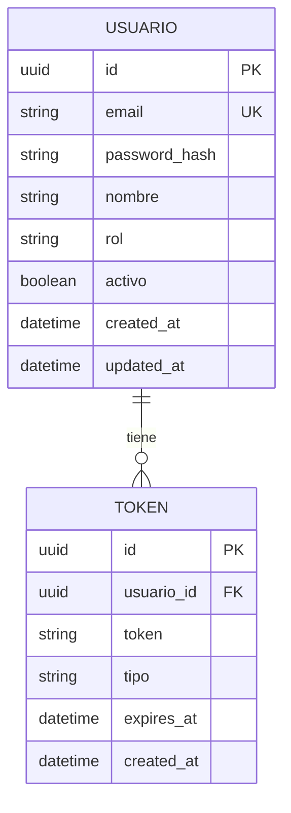

# Ejemplo Práctico: Módulo de Autenticación

## Necesidad de Negocio

```
"Necesito crear un sistema de autenticación para mi aplicación de empleados:
- Registro con email y contraseña
- Login con JWT
- Reset de contraseña por email
- Roles: admin, manager, empleado
- Protección de rutas"
```

---

## 1. REQUISITOS GENERADOS

### Historias de Usuario

```markdown
## HU-001: Registro de Usuarios
**COMO** usuario nuevo
**QUIERO** registrarme con email y contraseña
**PARA** acceder al sistema

**Criterios de Aceptación:**
- [ ] Email válido (formato email)
- [ ] Contraseña min 8 caracteres
- [ ] Confirmar registro por email
- [ ] No permitir emails duplicados
```

```markdown
## HU-002: Inicio de Sesión
**COMO** usuario registrado
**QUIERO** iniciar sesión con email y contraseña
**PARA** acceder a mi cuenta

**Criterios de Aceptación:**
- [ ] Validar credenciales
- [ ] Devolver JWT token
- [ ] Mantener sesión activa
- [ ] Bloquear tras 3 intentos fallidos
```

```markdown
## HU-003: Recuperar Contraseña
**COMO** usuario que olvidó su contraseña
**QUIERO** recuperar mi contraseña
**PARA** volver a acceder al sistema

**Criterios de Aceptación:**
- [ ] Enviar email con link de recuperación
- [ ] Link válido por 24 horas
- [ ] Nueva contraseña debe ser diferente
- [ ] Notificar cambio de contraseña
```

---

## 2. MODELO DE DATOS



---

## 3. BACKLOG PRIORIZADO

| Prioridad | Item | Estimación |
|-----------|------|------------|
| **Must Have** | Registro usuario | 4h |
| **Must Have** | Login JWT | 4h |
| **Must Have** | Middleware auth | 2h |
| **Must Have** | Protected routes | 2h |
| **Should Have** | Reset password | 4h |
| **Should Have** | Refresh token | 2h |
| **Could Have** | 2FA | 8h |
| **Could Have** | OAuth Google | 8h |
| **Wont Have** | Biometric | - |

---

## 4. CÓDIGO GENERADO (Backend)

### Modelo de Usuario (Python/FastAPI)

```python
from pydantic import BaseModel, EmailStr
from typing import Optional
from datetime import datetime
from enum import Enum

class Rol(str, Enum):
    ADMIN = "admin"
    MANAGER = "manager"
    EMPLEADO = "empleado"

class UsuarioCreate(BaseModel):
    email: EmailStr
    password: str  # Min 8 caracteres
    nombre: str
    rol: Rol = Rol.EMPLEADO

class UsuarioResponse(BaseModel):
    id: str
    email: str
    nombre: str
    rol: Rol
    activo: bool
    created_at: datetime

class Token(BaseModel):
    access_token: str
    token_type: str = "bearer"

# Modelo interno
class Usuario:
    def __init__(self, id: str, email: str, password_hash: str, nombre: str, rol: Rol, activo: bool):
        self.id = id
        self.email = email
        self.password_hash = password_hash
        self.nombre = nombre
        self.rol = rol
        self.activo = activo
```

### Endpoints (FastAPI)

```python
from fastapi import APIRouter, Depends, HTTPException, status
from fastapi.security import OAuth2PasswordBearer, OAuth2PasswordRequestForm

router = APIRouter(prefix="/auth", tags=["Auth"])
oauth2_scheme = OAuth2PasswordBearer(tokenUrl="token")

@router.post("/register", response_model=UsuarioResponse, status_code=201)
async def register(usuario: UsuarioCreate):
    # Validar email único
    if await get_usuario_by_email(usuario.email):
        raise HTTPException(status_code=400, detail="Email ya registrado")
    
    # Hash password
    hashed = hash_password(usuario.password)
    
    # Crear usuario
    db_usuario = Usuario(
        id=str(uuid4()),
        email=usuario.email,
        password_hash=hashed,
        nombre=usuario.nombre,
        rol=usuario.rol,
        activo=True
    )
    
    await save_usuario(db_usuario)
    
    return db_usuario

@router.post("/login", response_model=Token)
async def login(form: OAuth2PasswordRequestForm = Depends()):
    usuario = await authenticate_user(form.username, form.password)
    
    if not usuario:
        raise HTTPException(status_code=401, detail="Credenciales incorrectas")
    
    if not usuario.activo:
        raise HTTPException(status_code=403, detail="Usuario inactivo")
    
    # Generar token
    access_token = create_access_token(data={"sub": usuario.id, "rol": usuario.rol})
    
    return {"access_token": access_token, "token_type": "bearer"}

@router.get("/me", response_model=UsuarioResponse)
async def get_current_user(token: str = Depends(oauth2_scheme)):
    payload = verify_token(token)
    usuario = await get_usuario_by_id(payload["sub"])
    
    if not usuario:
        raise HTTPException(status_code=404, detail="Usuario no encontrado")
    
    return usuario

@router.post("/reset-password")
async def reset_password(email: EmailStr):
    # Enviar email con link de recuperación
    token = create_reset_token(email)
    await send_reset_email(email, token)
    return {"message": "Email de recuperación enviado"}
```

---

## 5. CÓDIGO GENERADO (Frontend)

### Zustand Store (Auth)

```typescript
import { create } from 'zustand';
import { persist } from 'zustand/middleware';

interface User {
  id: string;
  email: string;
  nombre: string;
  rol: 'admin' | 'manager' | 'empleado';
}

interface AuthState {
  user: User | null;
  token: string | null;
  isAuthenticated: boolean;
  
  login: (email: string, password: string) => Promise<void>;
  register: (email: string, password: string, nombre: string) => Promise<void>;
  logout: () => void;
  checkAuth: () => Promise<void>;
}

export const useAuthStore = create<AuthState>()(
  persist(
    (set, get) => ({
      user: null,
      token: null,
      isAuthenticated: false,

      login: async (email: string, password: string) => {
        const res = await fetch('/api/auth/login', {
          method: 'POST',
          headers: { 'Content-Type': 'application/x-www-form-urlencoded' },
          body: new URLSearchParams({ username: email, password }),
        });
        
        if (!res.ok) throw new Error('Login fallido');
        
        const data = await res.json();
        const token = data.access_token;
        
        // Obtener usuario
        const userRes = await fetch('/api/auth/me', {
          headers: { Authorization: `Bearer ${token}` },
        });
        const user = await userRes.json();
        
        set({ user, token, isAuthenticated: true });
      },

      register: async (email: string, password: string, nombre: string) => {
        const res = await fetch('/api/auth/register', {
          method: 'POST',
          headers: { 'Content-Type': 'application/json' },
          body: JSON.stringify({ email, password, nombre }),
        });
        
        if (!res.ok) throw new Error('Registro fallido');
        
        // Auto login después de registro
        await get().login(email, password);
      },

      logout: () => {
        set({ user: null, token: null, isAuthenticated: false });
      },

      checkAuth: async () => {
        const token = get().token;
        if (!token) return;
        
        try {
          const res = await fetch('/api/auth/me', {
            headers: { Authorization: `Bearer ${token}` },
          });
          
          if (res.ok) {
            const user = await res.json();
            set({ user, isAuthenticated: true });
          } else {
            get().logout();
          }
        } catch {
          get().logout();
        }
      },
    }),
    { name: 'auth-storage' }
  )
);
```

### Protected Route Component

```tsx
import { Navigate, useLocation } from 'react-router-dom';
import { useAuthStore } from '../stores/authStore';

interface ProtectedRouteProps {
  children: React.ReactNode;
  allowedRoles?: ('admin' | 'manager' | 'empleado')[];
}

export const ProtectedRoute = ({ children, allowedRoles }: ProtectedRouteProps) => {
  const { isAuthenticated, user } = useAuthStore();
  const location = useLocation();

  if (!isAuthenticated) {
    return <Navigate to="/login" state={{ from: location }} replace />;
  }

  if (allowedRoles && user && !allowedRoles.includes(user.rol)) {
    return <Navigate to="/unauthorized" replace />;
  }

  return <>{children}</>;
};
```

---

## 6. TESTS GENERADOS

```python
import pytest
from fastapi.testclient import TestClient
from app.main import app

client = TestClient(app)

def test_register_success():
    response = client.post("/api/auth/register", json={
        "email": "test@example.com",
        "password": "password123",
        "nombre": "Test User"
    })
    assert response.status_code == 201
    assert "id" in response.json()

def test_register_duplicate_email():
    # Primer registro
    client.post("/api/auth/register", json={
        "email": "test@example.com",
        "password": "password123",
        "nombre": "Test User"
    })
    
    # Segundo registro con mismo email
    response = client.post("/api/auth/register", json={
        "email": "test@example.com",
        "password": "password456",
        "nombre": "Another User"
    })
    assert response.status_code == 400

def test_login_success():
    # Registrar primero
    client.post("/api/auth/register", json={
        "email": "test2@example.com",
        "password": "password123",
        "nombre": "Test User"
    })
    
    # Login
    response = client.post("/api/auth/login", data={
        "username": "test2@example.com",
        "password": "password123"
    })
    assert response.status_code == 200
    assert "access_token" in response.json()

def test_login_invalid_credentials():
    response = client.post("/api/auth/login", data={
        "username": "nonexistent@example.com",
        "password": "wrongpassword"
    })
    assert response.status_code == 401
```

---

## 7. DEPLOY (Dockerfile)

```dockerfile
# Backend
FROM python:3.12-slim

WORKDIR /app

COPY requirements.txt .
RUN pip install --no-cache-dir -r requirements.txt

COPY . .

EXPOSE 8000

CMD ["uvicorn", "app.main:app", "--host", "0.0.0.0", "--port", "8000"]
```

---

## RESUMEN: LO QUE SE GENERÓ

| Componente | Tiempo Estimado |
|------------|-----------------|
| Historias de usuario | 10 min |
| Modelo de datos | 5 min |
| Backend (FastAPI) | 15 min |
| Frontend (React) | 15 min |
| Tests | 10 min |
| **Total** | **~1 hora** |

**Con IA: ~1 hora**
**Sin IA (tradicional): ~8 horas**

---

¿Te sirve este ejemplo? ¿Quieres que generemos otro módulo?
